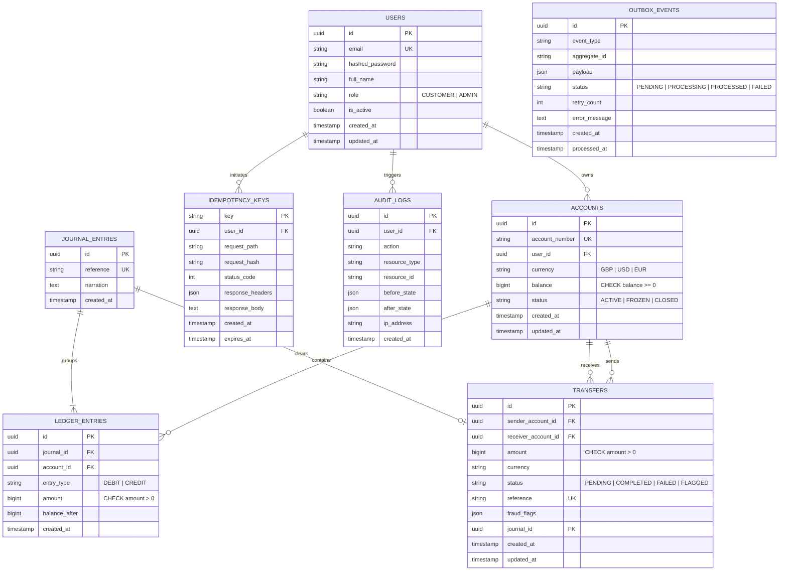

# Entity-Relationship (ER) Diagram & Schema Specification

## Schema Constraints & Invariants:
1. **CHECK `accounts.balance >= 0`**: Prevents unauthorized overdrafts at the database engine level.
2. **CHECK `ledger_entries.amount > 0`**: Ensures zero or negative ledger entries cannot corrupt bookkeeping.
3. **CHECK `transfers.amount > 0`**: Guarantees transfer values are strictly positive.
4. **UNIQUE `accounts.account_number`**: Guarantees unique bank account identification.
5. **UNIQUE `idempotency_keys.key`**: Prevents duplicate transaction execution by key replay.
6. **Append-Only `audit_logs`**: Logs are strictly inserted, never mutated or deleted.
